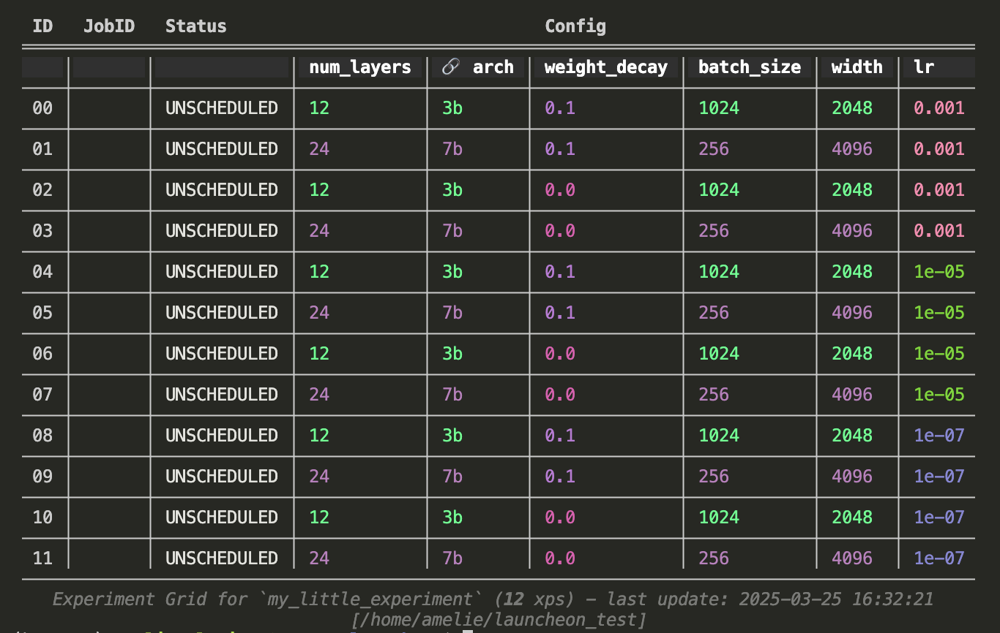

# launcheon

  
 
 [](https://github.com/kyutai-labs/launcheon/actions/workflows/lint.yml) [](https://github.com/kyutai-labs/launcheon/actions/workflows/typing.yml) [](https://github.com/kyutai-labs/launcheon/actions/workflows/test.yml) 
 
 ``launcheon`` - A simple and customisable manager for experiments with a focus on results visualization. Launcheon automatically generates CLI commands to run based on *(i)* an experiment sweep defined either as a Python object or a YAML file and *(ii)* a chosen backend for job submissions (e.g. SLURM cluster, or simple bash commands run on a local machine). 

  * [Installation](#-installation)
  * [Quickstart](examples/01_simple_grid/README.md)
  * Defining a simple experiment sweep:
    * [Using a YAML configuration file](docs/doc_yaml.md)
    * [Using the Python API (+customization)](docs/doc_python.md)
  * [List of all available commands](docs/doc_cli.md)
  * Useful features and advanced use cases:
    * Advanced sweep definition using grouped flags and secret keys
    * Chaining experiment grids for large-scale sweeps (e.g., synchronized training and eval sweeps)
    * Automatically building table views of your experiment grid using the `table` command and expand this to include results and metrics


## 🐣 Installation

#### As an external package (via git)

```bash
pip install -U git+https://github.com/kyutai-labs/launcheon
```


#### For development

First, install `uv`
```bash
curl -LsSf https://astral.sh/uv/install.sh | sh
```

Then clone this repo
```bash
git clone https://github.com/kyutai-labs/launcheon.git
cd launcheon
```

Now you should be able to run all comands as follows (see list of commands below):

```bash
# run with python api
uv run python examples/01_simple_grid/python_api_usage.py print name

# run with yaml api
uv run launcheon examples/01_simple_grid/yaml_api_usage.yml print name
```

Before any push to the main branch, verify that the CI completes successfully by running `bash verify.sh` (ruff / pyright).


## 🐥 Quickstart

A `launcheon` experiment grid can be defined either via a simple YAML configuration file or via the Python API. In particular, in the latte case the script can then be used directly from the command line, inheriting all methods of `ExperimentGrid` as subcommands and can be further configured with additional methods.

Below you can find example of useful commands. A list of all available commands is given [here](docs/doc_cli.md).


|     | Python API | YAML API |
| --- | ---------- | -------- |
| Pros | Can add custom methods + can re-use/share configs across experiment grids |  Simple and structured. Easier to share  |
| Cons | More prone to syntax errors (dictionary formatting) | More rigid format |
| Example | [`examples/01_simple_grid/python_api_usage.py`](examples/01_simple_grid/python_api_usage.py) | [`examples/01_simple_grid/yaml_api_usage.yml`](examples/01_simple_grid/yaml_api_usage.yml) |
| Command | `python python_api_usage.py ....` | `launcheon yaml_api_usage.yml ...`|


For instance, to print the names of all experiments in the sweep:
```bash
    python examples/01_simple_grid/python_api_usage.py print name
    # or
    launcheon examples/01_simple_grid/yaml_api_usage.yml print name
```

To print the command corresponding to the 2nd and 7th experiment of the sweep
```bash
    python examples/01_simple_grid/python_api_usage.py select 1,6 print cmd
    # or
    launcheon examples/01_simple_grid/yaml_api_usage.yml select 1,6 print cmd
```

To print the status of all experiments based on a certain flag name/value:
```bash
    python examples/01_simple_grid/python_api_usage.py filter weight_decay ">" 0 print status
    # or 
    launcheon examples/01_simple_grid/yaml_api_usage.yml filter weight_decay ">" 0 print status
```

To submit all experiments as a SLURM job array with at most 4 experiments running in parallel (and 
overwriting the log directory in case one of these experiments has already been run)
```bash
    python examples/01_simple_grid/python_api_usage.py submit --max_parallel 4 --overwrite
    # or 
    launcheon examples/01_simple_grid/yaml_api_usage.yml submit --max_parallel 4 --overwrite
```

To print a live monitor of the last 5 lines of the logfile of all experiments which have a job currently running
```bash
    python examples/01_simple_grid/python_api_usage.py select running monitor -5
    # or 
    launcheon examples/01_simple_grid/yaml_api_usage.yml select running monitor -5
```

To print the log directory of a specific experiment (here, 4th experiment in the grid) and its contents
```bash
    python examples/01_simple_grid/python_api_usage.py select 3 print logdir
    # or 
    launcheon examples/01_simple_grid/yaml_api_usage.yml select 3 print logdir
```

To launch a Tensorboard instance on all the experiemnts' log directories
```bash
    python examples/01_simple_grid/python_api_usage.py tensorboard --port 8899
    # or 
    launcheon examples/01_simple_grid/yaml_api_usage.yml tensorboard --port 8899
```

To display a quick overview of the experiments sweep
```bash
    python examples/01_simple_grid/python_api_usage.py table --exclude tb_dir,ckpt_dir,out_dir
    # or 
    launcheon examples/01_simple_grid/yaml_api_usage.yml table --exclude tb_dir,ckpt_dir,out_dir
```

